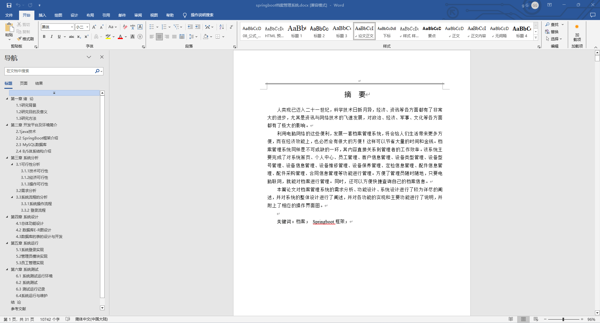
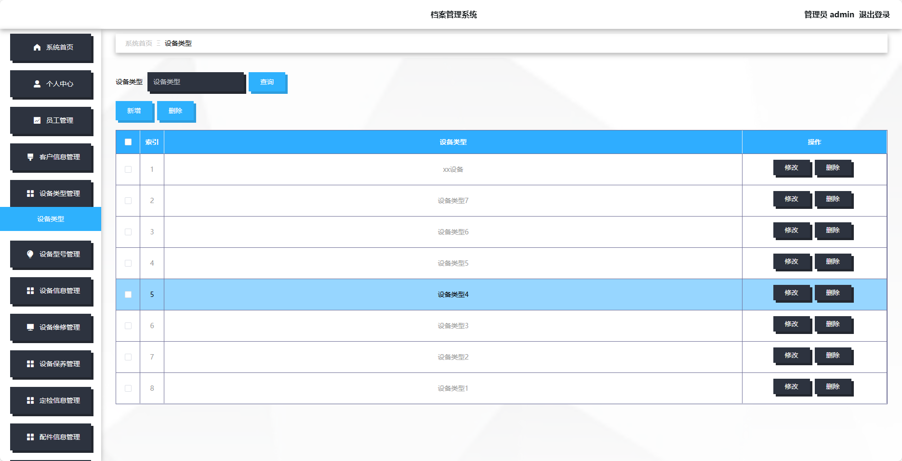
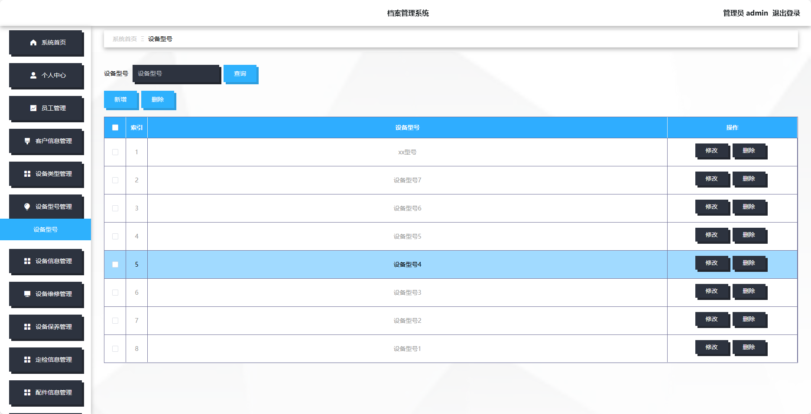
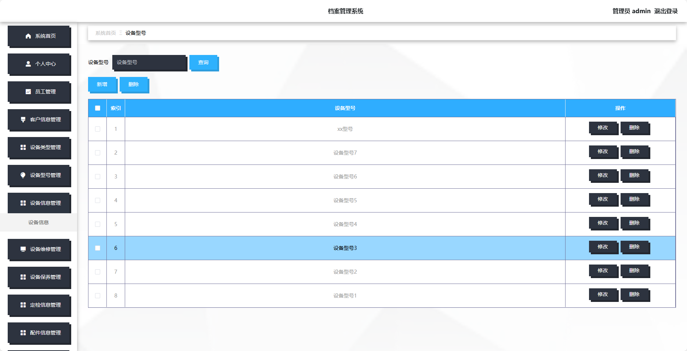
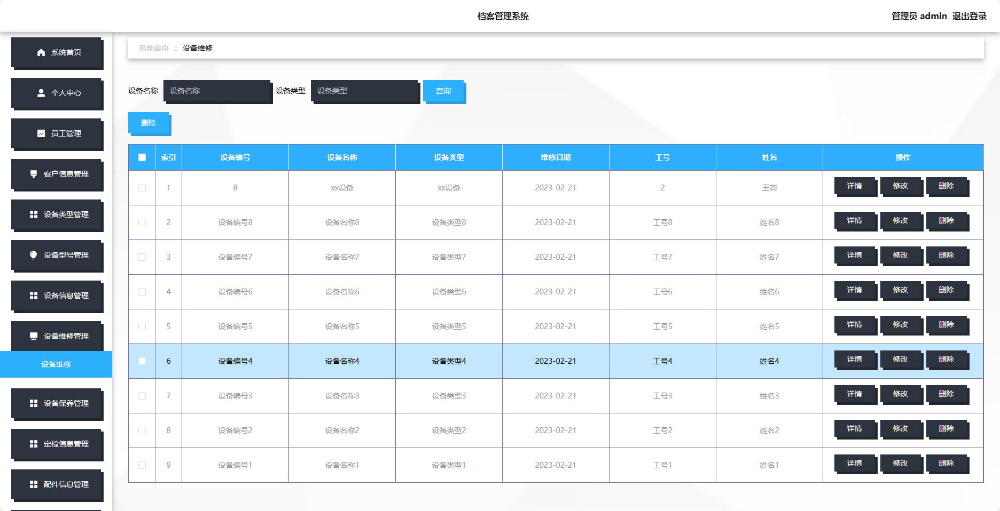
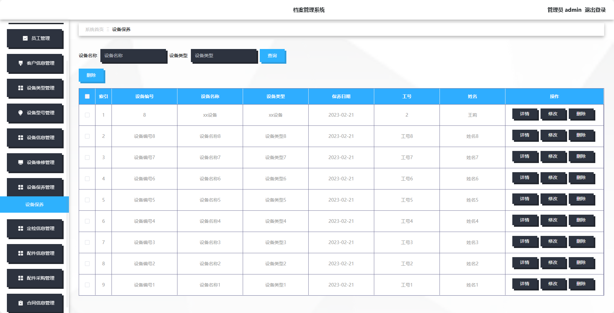
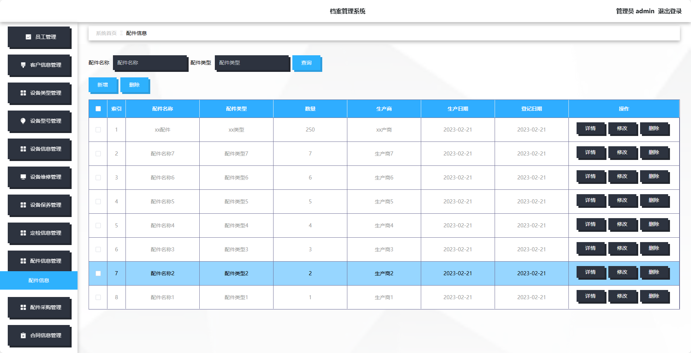
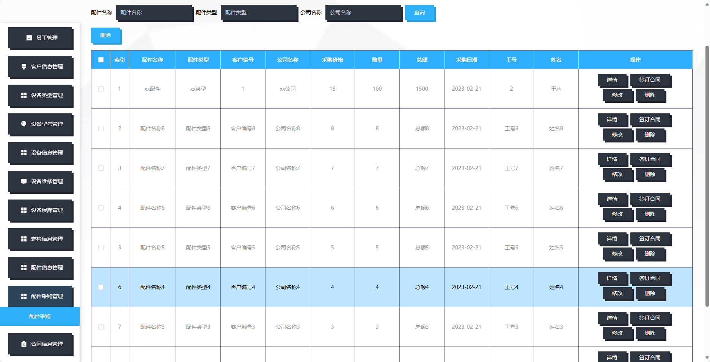
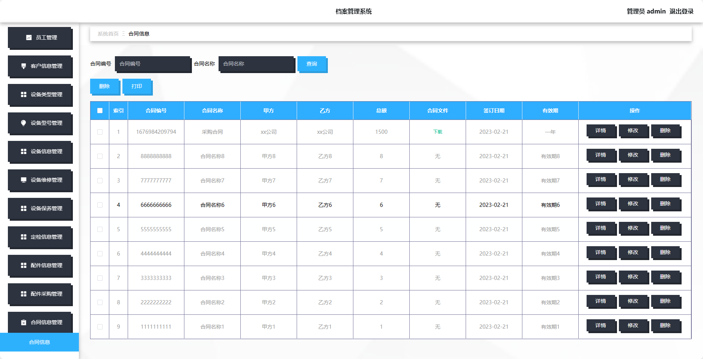

## 基于SpringBoot的档案管理系统(程序+报告)

- <b>完整代码获取地址：从戎源码网 ([https://armycodes.com/](https://armycodes.com/))</b>
- <b>技术探讨、资料分享，请加QQ群：692619798</b> 
- <b>作者微信：19941326836  QQ：952045282</b> 
- <b>承接计算机毕业设计、Java毕业设计、Python毕业设计、深度学习、机器学习</b>
- <b>选题+开题报告+任务书+程序定制+安装调试+论文+答辩ppt 一条龙服务</b>
- <b>所有选题地址 ([https://github.com/YuLin-Coder/AllProjectCatalog](https://github.com/YuLin-Coder/AllProjectCatalog)) </b>
## 项目介绍
基于SpringBoot的档案管理系统，系统包含两种角色：管理员、用户,系统分为前台和后台两大模块，主要功能如下。

### 【管理员】:
- 个人中心：管理个人信息和账户。
- 员工管理：管理员工账号，包括新增、编辑、删除员工账号。
- 客户信息管理：管理客户信息，包括新增、编辑、删除客户信息。
- 设备类型管理：管理设备类型，包括新增、编辑、删除设备类型。
- 设备型号管理：管理设备型号，包括新增、编辑、删除设备型号。
- 设备信息管理：管理设备信息，包括新增、编辑、删除设备信息。
- 设备维修管理：管理设备维修记录，包括新增、编辑、删除设备维修记录。
- 设备保养管理：管理设备保养记录，包括新增、编辑、删除设备保养记录。
- 定检信息管理：管理定期检查信息，包括新增、编辑、删除定期检查信息。
- 配件信息管理：管理配件信息，包括新增、编辑、删除配件信息。
- 配件采购管理：管理配件采购记录，包括新增、编辑、删除配件采购记录。
- 合同信息管理：管理合同信息，包括新增、编辑、删除合同信息。

### 【员工】:
- 个人中心：管理个人信息和账户。
- 客户信息管理：包括客户信息的新增、编辑、删除和查询功能。
- 设备信息管理：包括设备信息的新增、编辑、删除和查询功能。
- 设备维修管理：包括设备维修记录的新增、编辑、删除和查询功能。
- 设备保养管理：包括设备保养记录的新增、编辑、删除和查询功能。
- 定检信息管理：包括定期检查信息的新增、编辑、删除和查询功能。
- 配件信息管理：包括配件信息的新增、编辑、删除和查询功能。
- 配件采购管理：包括配件采购记录的新增、编辑、删除和查询功能。

### 【前台】:
- 首页：展示系统的概况、最新资讯等内容。
- 个人中心：用户可以管理个人信息、修改密码等。
- 客户信息管理：包括客户信息的新增、编辑、删除和查询功能。
- 设备信息管理：包括设备信息的新增、编辑、删除和查询功能。
- 设备维修管理：包括设备维修记录的新增、编辑、删除和查询功能。
- 设备保养管理：包括设备保养记录的新增、编辑、删除和查询功能。
- 定检信息管理：包括定期检查信息的新增、编辑、删除和查询功能。
- 配件信息管理：包括配件信息的新增、编辑、删除和查询功能。
- 配件采购管理：包括配件采购记录的新增、编辑、删除和查询功能。

## 项目技术
- 编程语言：Java
- 数据库：MySQL
- 项目管理工具：Maven
- 前端技术：HTML、CSS、JavaScript、Jquery、Vue
- 后端技术：Spring、SpringMVC、MyBatis

## 运行环境
- JDK版本：JDK1.8及以上
- 开发工具：IDEA、Ecplise、Myecplise都可以
- 数据库: MySQL5.7及以上
- Maven：maven3.0及以上
- Node：14.14.0及以上

## 运行截图

